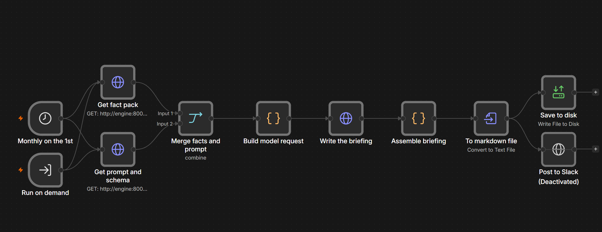

# Manukora — Monthly S&OP Briefing Automation

Turns four months of SKU-level sales and inventory data into a monthly S&OP briefing an
executive can read in five minutes and act on.

**→ [The generated briefing](output/sop_briefing_march-2026.md)** · **→ [Part 2 architecture](ARCHITECTURE.md)** · **→ [How it was verified](n8n/VERIFICATION.md)**

> **If you have ten minutes**, read the [briefing](output/sop_briefing_march-2026.md) — it
> is the deliverable — then [what the AI got wrong](#where-the-ai-helped-where-it-was-wrong-and-what-i-fixed),
> which is the most honest thing here. Everything else is depth you can skip.
>
> **Twenty minutes:** add [`prompts/CHANGELOG.md`](prompts/CHANGELOG.md) for what happened
> when I ran the naive first prompt, and [`n8n/VERIFICATION.md`](n8n/VERIFICATION.md) for
> the workflow running end to end.



*The monthly workflow, which [runs end to end in twenty seconds](n8n/VERIFICATION.md) and
writes a briefing that passes the same tests as the CLI's. Two HTTP calls — the fact pack
and the prompt — merge before the model writes, because n8n cannot execute this project's
Python and the prompt is served rather than copied. Slack is wired and deliberately off.
Getting it to run surfaced three silent config failures, each documented.*

---

## Quick start

```bash
git clone https://github.com/diembz/manukora-sop-briefing
cd manukora-sop-briefing
pip install pytest              # the only dependency, and only for the tests

python -m src.main --no-llm     # complete briefing, no API key required
python -m pytest -q             # 60 tests, no secrets needed
```

`--no-llm` renders the whole briefing from a deterministic template — same figures, plainer
prose. Nothing here needs a key to run, and both briefings are committed, so the output can
be evaluated without running anything at all.

To have a model write the prose: put a key in `.env` and drop the flag.

| File in `output/` | Written by |
|---|---|
| `sop_briefing_march-2026.md` | **A model, via the CLI.** The deliverable |
| `sop_briefing_from_n8n.md` | **The n8n workflow**, run end to end — see [VERIFICATION](n8n/VERIFICATION.md) |
| `sop_briefing_march-2026_template.md` | The deterministic template. The control |
| `facts_march-2026.json` | The engine. All three render from this |

All three are held to the same tests: no figure without a source, inside the reading
budget, no cents in prose, leading with the decision the engine ranked first.

**Providers.** The narrative layer takes whichever key is present — `ANTHROPIC_API_KEY`
first, then `GEMINI_API_KEY`. Both enforce the output schema server-side (Anthropic through
structured outputs, Google through `responseSchema`), so the guarantee is the same either
way. Neither needs an SDK: both are plain HTTPS calls over the standard library, so you can
run this without installing a client for a vendor you do not use.

Keeping it swappable is not a hedge. The narrative layer is the one place in this project
where the vendor is genuinely an implementation detail, because everything that matters —
the figures, the ranking, the business rules — is decided before the call is made. The
committed briefing was generated with Gemini, because that was the key on hand.

> **A note on data hygiene.** Google's free tier reserves the right to train on submitted
> data. That is acceptable here — the dataset is mock data from an exercise brief. With
> real Manukora sales figures it would not be, and the provider choice would need to be
> made on that basis rather than on which key was convenient.

---

## The idea

**The language model never does arithmetic.**

Every number is computed in Python, covered by a test, and serialised to `facts.json`. The
model receives those facts and writes prose around them — it cannot calculate, estimate, or
infer a figure, because [the schema it must satisfy](src/schema.py) has no numeric field at
all.

That split is what makes the output checkable. `tests/test_output_integrity.py` extracts
every figure from the finished briefing and asserts each one traces back to a computed
fact; an invented number fails the build.

```
data/mock_sales.csv
      │
      ▼
  engine.py ──────────────► facts.json ──────┬──► narrative.py (model writes prose)
  every calculation,                          │
  every business rule,                        └──► render.py   (template writes prose)
  covered by tests                                     │
                                                       ▼
                                            compose_briefing()
                                        one assembler, tables from facts
```

Both paths load the same prompt and render through the same assembler, so they cannot drift
into producing different documents — and the template render doubles as a control on the
model's.

---

## What the briefing actually says

Not a summary of the spreadsheet. Three findings drove the recommendations:

**The weakest seller is where the capital is stuck.** MGO 100+ 250g grew +0.8% against a
range moving +7.5% — the only SKU not keeping pace — while holding 6.2 months of cover
against a 2-month target, with 2,000 more units inbound that take it to 7.14. The
recommendation is not to reorder. It is to hold that shipment and move the working capital
to the six SKUs that are actually short.

**An order in flight does not settle the question.** MGO 1700+ 100g has stock on the water
and still lands at 2.13 months against its 3-month target. Treating "an order exists" as
"handled" would have dropped it from the queue entirely.

**The reorder trigger accounts for lead time.** Firing when cover falls below target means
the replenishment arrives two months after the buffer was already breached. Triggering at
`target + lead time` surfaces MGO 263+ 500g — above target today, and unrecoverable if you
wait for it to dip.

The queue totals 5,584 units across 6 SKUs, 5 of them already past the date they should
have been placed.

---

## Business rules from the brief

All of these live in [`src/config.py`](src/config.py), tagged `BRIEF` where the exercise
states them and `ASSUMPTION` where it does not.

| Rule | How it is handled |
|---|---|
| M1 is December 2025, M4 is March 2026 | The output names months. `M4` is a column header, not something an executive should translate |
| Bioactive Blends launched mid-January | Trend measured from January. December would inflate their growth on an artefact of the launch date |
| Propolis Tincture is phasing out in Q2 2026 | Flagged for stockout risk, not reordered above 30 days of cover |
| MGO 1700+ 100g targets 3 months | Declared in config and cross-checked against the dataset on load |
| March demand is the sell-through baseline | Cover is stock divided by March units |
| Shopify and Amazon pool one inventory | Demand is the sum of both channels everywhere |
| `Order_Arrival_Months = 0` means no order | Treated as "nothing inbound", never "arrives immediately" |

Each has a test that fails on the *wrong* reading, not just one that passes on the right
one — see [verification](#how-i-verified-it).

## Assumptions I made

The brief is silent on these. Each is declared in `config.py` and listed in
[`OPEN-QUESTIONS.md`](OPEN-QUESTIONS.md) with the reasoning and what would change if the
answer differs.

- **Supplier lead time is 2 months, 3 for MGO 1700+.** Not in the data; inferred from
  `Order_Arrival_Months`. This drives every quantity and every date, so it is the first
  thing to confirm.
- **Reorder when cover falls below target *plus* lead time**, not at the target itself.
- **Target cover is the buffer wanted on arrival**, so a reorder covers transit and target.
- **"Overstocked" is more than twice the target** — a threshold, chosen to flag outliers.
- **"Sold poorly" means falling behind the range.** Nothing declined this month, so the
  briefing says that plainly rather than implying a fall that did not happen.

---

## Approach and tradeoffs

**Deterministic engine, model only for prose.** Costs a schema and an assembler. Buys an
output that can be tested, a briefing that runs with no key, and the ability to say "the
figures are correct" and mean it. The alternative — one prompt, one call — is a third of the
code and cannot be verified without recomputing every figure by hand, every month.

**Structured outputs over free text.** The model returns a schema-validated object, so a
briefing cannot come back missing the tension section or with a recommendation that has no
rationale. Costs some flexibility in how the model can organise its answer; buys a document
whose shape is guaranteed before anyone reads it.

**No SQL in Part 1.** A twelve-row CSV does not need a database, and adding one would be
the overbuilding the brief warns against. It belongs in Part 2, where a *daily* brief
genuinely needs snapshot tables to answer "what changed overnight". Stated here so it reads
as a decision rather than an omission.

**Reading budget counts prose, not table cells.** Table rows are scanned column by column,
not read as sentences; counting them against a five-minute budget would penalise exactly
the format that makes a briefing fast.

**Depth where the money is.** The top two recommendations get a full paragraph of reasoning,
the rest get one clause each. Six equal paragraphs would bury the two that matter.

---

## The prompt stack

There are two, and both are in the repo.

| | Where | What it does |
|---|---|---|
| **Build-time** | [`CLAUDE.md`](CLAUDE.md), [`prompts/build-stack.md`](prompts/build-stack.md) | How this repo was built with Claude Code |
| **Run-time** | [`prompts/v1_baseline.md`](prompts/v1_baseline.md) → [`v2_final.md`](prompts/v2_final.md) | How a briefing gets written each month |

**The first prompt** handed the model the raw CSV and asked for a briefing. **The one I
actually use** hands it a fact pack with every figure already computed and asks only for
prose.

### I ran v1, and it recommended buying stock for a discontinued product

Same model as the production path, so the prompt is the only variable. Output committed at
[`prompts/v1_baseline_output.md`](prompts/v1_baseline_output.md); reproduce with
`python scripts/run_v1_baseline.py`.

v1 is not obviously bad — it got the MGO 1700+ three-month target right, read
`Order_Arrival_Months = 0` correctly, got every cover figure right to two decimals, and
produced a well-organised document. Then it says this about Propolis Tincture 30ml, which
is being retired this quarter:

> *"Stock cover is at a critical 1.37 months. Issue an immediate emergency batch order of
> 500 units."*

It never mentions the phase-out anywhere. It also got January and February portfolio totals
wrong — by 48 and 120 units, in the trend section the brief asked for by name — while
getting December and March exactly right. And it labels the overstocked, stalling SKU
"HEALTHY", noting the 2,000 inbound units in a table cell and recommending nothing about
them: the most valuable observation in the dataset, present as a data point and absent as a
decision.

**The problem is not that v1 made mistakes. It is that its mistakes are invisible.**
Correct figures and wrong ones are formatted identically, and the one recommendation that
would lose money is the most confidently worded sentence on the page. No wording fixes
that — only moving the arithmetic somewhere it can be tested. v1's last line was "make sure
your numbers are accurate", which is the tell: an instruction you cannot check is a hope.

Full change-by-change account in [`prompts/CHANGELOG.md`](prompts/CHANGELOG.md).

---

## Where the AI helped, where it was wrong, and what I fixed

**Where it helped:** drafting the engine and the test suite quickly, and — more usefully —
five structured review passes over the design before any code existed. Each pass used a
different lens and each found something the last could not. The fourth asked "would this
actually run?" and found that n8n cannot execute the Python: the container has no
interpreter and no access to the host repo, so the central arrow in my own diagram had
nothing behind it.

**Where it was wrong, with the fixes:**

**It fabricated two figures.** The design document claimed one SKU was "22% of total revenue
opportunity" and another needed "~1,150 units". Checked against the engine: 16.6% and 934.
Both plausible, both wrong, both written into the document that proposed a test against
exactly this failure. That produced the no-hand-typed-figures rule in `CLAUDE.md` and
`tests/test_output_integrity.py` — which is not a hypothetical guard against model
hallucination but a response to a failure that already happened here.

**It got the reorder trigger wrong**, firing when cover fell below target — two months too
late on a two-month lead time. Fixed to the standard reorder point, which surfaced a SKU
the original logic missed entirely.

**It wrote a sentence that was confidently false**, saying an order placed today "lands
around 16 June, which is roughly when the shelf empties" — that date was the stockout, not
the arrival. Fixed by computing both dates separately so the sentence has to name which is
which.

**It picked the wrong headline**, leading with the SKU holding the most capital rather than
the one with the hardest decision. A fast-selling product that is merely over-covered is a
scheduling question; a stalled one is a capital question.

**What running it taught me that reading it could not.** The briefing in `output/` is
written by a model and passes the integrity check. Getting there surfaced three things:

The check had **two false-positive modes** that only real prose triggers. The model wrote
"the MGO 263+ and MGO 514+ formats" — dropping the "Manuka Honey" prefix, as any writer
would — and five product codes were reported as invented figures. It also wrote
"May 1, 2026" where the renderer writes "1 May 2026", orphaning the year. Both would have
become flaky CI failures within a week, and a flaky integrity check gets deleted rather
than fixed. Both are now regression tests.

And **the model took a decision that belonged to the engine**: asked for a headline, it led
with the most urgent reorder instead of the hardest one. Defensible, but ranking is the
engine's job and letting the model choose meant the lead would vary run to run. Fixed in
the prompt *and* enforced in `check_against_facts()` — prompt for intent, enforce in code.

**What still has not been run:** `providers.py` implements both Anthropic and Google, but
only the Google path has actually returned a briefing. Both enforce the output schema
server-side, and the Anthropic request shape is written against the documented API and
reviewed — but reviewed is not proven, and this section exists to keep that distinction.

---

## How I verified it

```bash
python -m pytest -q     # 60 tests
```

**The maths.** `tests/test_business_rules.py` has one test per rule the brief states, and
where possible each also demonstrates what the *wrong* reading produces. Reading
`Order_Arrival_Months = 0` as "arrives now" would credit SKUs with stock they do not have
and empty the queue of exactly the SKUs needing attention — that is asserted, not assumed.
`tests/test_engine.py` pins reference totals worked out by hand before the engine existed,
and covers what is easy to get subtly wrong: growth compounds rather than averaging, and
cover-after-arrival subtracts the demand consumed while the shipment is in transit.

**The output.** `tests/test_output_integrity.py` asserts every figure in the briefing traces
to `facts.json`, and — because a test that cannot fail proves nothing — separately proves it
catches an invented figure and proves it does not fire on SKU names, dates, or years.

**The documentation.** `tests/test_docs_claims.py` checks the one figure here that no fact
pack can source — the size of the suite, quoted twice above. It had drifted: typed once and
left there while the suite grew past it. A count only the author maintains is a claim nobody
checks, so the build checks it now.

**Reproducibility.** CI runs the suite with no secrets, regenerates the briefing without an
API key, and fails if the committed output drifts from what the code produces.

---

## Repository layout

| Path | |
|---|---|
| [`data/`](data/) | The mock dataset from the brief, verbatim |
| [`src/`](src/) | Config, loader, engine, schema, providers, narrative, renderer, CLI, and the `/facts` service n8n calls |
| [`scripts/`](scripts/) | `run_v1_baseline.py` — reproduces the v1 run |
| [`prompts/`](prompts/) | Both prompt stacks and the changelog |
| [`tests/`](tests/) | Business rules, arithmetic, output integrity, documentation claims |
| [`output/`](output/) | The generated briefing and its fact pack |
| [`n8n/`](n8n/) | Workflow export and canvas screenshot |
| [`skills/`](skills/) | Reusable procedure for running and adapting this |
| [`CLAUDE.md`](CLAUDE.md) | Build-time instructions and the rules this repo runs under |
| [`RUNBOOK.md`](RUNBOOK.md) | What breaks and how to fix it |
| [`OPEN-QUESTIONS.md`](OPEN-QUESTIONS.md) | What I would have asked before anyone acts on this |

---

## What I would do next

Connect the real sources. The engine takes a validated table; swapping the CSV loader for
Shopify and SP-API clients does not touch the calculations or the tests.

Then add the previous year. Four months cannot separate growth from season, and every
projection here extrapolates a four-month trend — the ranking is fairly robust to that, but
the absolute figures deserve less confidence than they currently invite.
